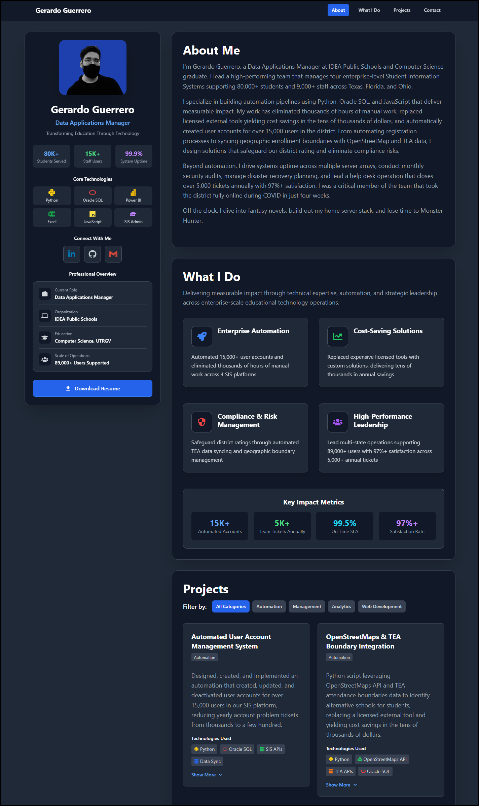

# Gerardo's Portfolio Website

My personal portfolio website built with React, TypeScript, and NextJS. This was a good opportunity to showcase my work and qualifications while re-affirming my learning of these web dev technologies.

This is a [Next.js](https://nextjs.org/) project bootstrapped with [`create-next-app`](https://github.com/vercel/next.js/tree/canary/packages/create-next-app).

The purpose of this site was to solidify the learning of:

- [Tailwind](https://tailwindcss.com/) for the css utility classes that allowed for rapid development
- [TypeScript](https://www.typescriptlang.org/) to learn type safety in JavaScript
- [CSS Flex](https://developer.mozilla.org/en-US/docs/Web/CSS/flex)
- [CSS Grid](https://developer.mozilla.org/en-US/docs/Web/CSS/CSS_Grid_Layout)

## Table of Contents

- [Gerardo's Portfolio Website](#jerry-s-portfolio-website)
  - [Table of Contents](#table-of-contents)
  - [Author](#author)
  - [Homepage](#homepage)
  - [Screenshot](#screenshot)
  - [Tech Stack](#tech-stack)
  - [Lessons Learned](#lessons-learned)
    - [React](#react)
    - [NextJS](#nextjs)
    - [Responsive Design](#responsive-design)
    - [Source Control](#source-control)
  - [Run Locally](#run-locally)
  - [Project Structure](#project-structure)

## Author

**Gerardo Guerrero** - Data Applications Manager  
[LinkedIn](https://www.linkedin.com/in/gerardo-guerrero2/) | [GitHub](https://github.com/Durzo95)

Leading enterprise-scale educational technology operations across Texas, Florida, and Ohio, managing four Student Information Systems and delivering automation solutions that save thousands of hours annually.

## Homepage

[Link to Application](https://www.jerryguerrero.com/)

## Screenshot



## Tech Stack

**Client:** [React](https://reactjs.org/)

**Server:** [NextJS](https://nextjs.org/)

**Languages:** [Javascript](https://www.javascript.com/), [TypeScript](https://www.typescriptlang.org/)

## Lessons Learned

### React

- [JSX](https://reactjs.org/docs/introducing-jsx.html)
- [Components and Props](https://reactjs.org/docs/components-and-props.html)

### NextJS

- [Server Side and Static Page Rendering](https://nextjs.org/docs/basic-features/data-fetching/overview)
- [Layouts](https://nextjs.org/docs/basic-features/layouts)
- [Deployment to Vercel](https://nextjs.org/docs/deployment)

### Responsive Design

- [Tailwind CSS utility classes](https://tailwindcss.com/docs/installation)
- [CSS Flex](https://developer.mozilla.org/en-US/docs/Web/CSS/flex)
- [CSS Grid](https://developer.mozilla.org/en-US/docs/Web/CSS/CSS_Grid_Layout)

### Source Control

- [Github CI/CD](https://resources.github.com/ci-cd/)
- [Branches](https://docs.github.com/en/pull-requests/collaborating-with-pull-requests/proposing-changes-to-your-work-with-pull-requests/about-branches)

## Run Locally

Clone the repo

```bash
git clone https://github.com/Durzo95/jerry-guerrero-portfolio.git
```

Move to directory

```bash
cd jerry-guerrero-portfolio
```

Install dependencies

```bash
npm install
```

Then, run the development server:

```bash
npm run dev
```

Open [http://localhost:3000](http://localhost:3000) with your browser to see the result.

## Project Structure

```
jerry-guerrero-portfolio/
├── components/           # React components
│   ├── Navigation.tsx   # Main navigation with scroll detection
│   ├── Profile.tsx      # Professional profile sidebar
│   ├── MainBody.tsx     # Main content sections
│   ├── ProjectCard.tsx  # Individual project showcases
│   ├── ProjectFilter.tsx # Project category filtering
│   ├── ContactSection.tsx # Contact information
│   └── ...
├── data/                # TypeScript data files
│   ├── projectsData.ts  # Project information and metadata
│   ├── whatIDoData.ts   # Professional expertise areas
│   ├── socialMediaData.ts # Social media links
│   └── demoInfoData.ts  # Professional overview data
├── pages/               # Next.js pages
│   ├── index.tsx        # Homepage
│   └── _app.tsx         # App wrapper component
├── public/              # Static assets
│   ├── Headshot.png     # Headshot
│   ├── preview.png      # Portfolio preview image
│   └── favicon.ico      # Site favicon
├── styles/              # Global styles and Tailwind config
│   └── globals.css      # Global CSS with Tailwind imports
├── .gitignore           # Git ignore rules
├── next.config.js       # Next.js configuration
├── package.json         # Dependencies and scripts
├── postcss.config.js    # PostCSS configuration
├── tailwind.config.js   # Tailwind CSS configuration
├── tsconfig.json        # TypeScript configuration
└── README.md            # Project documentation
```
